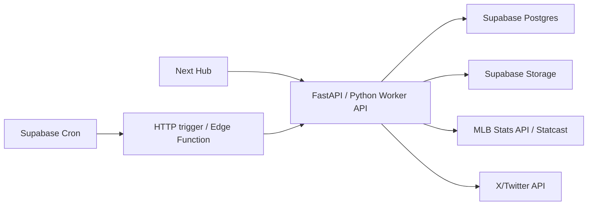

# MLB Ops Operating Model
> **ARCHIVED — June 2026.** Supabase control-plane plan was superseded by VPS Postgres. See [`../CURRENT_STATE.md`](../CURRENT_STATE.md). Kept for historical context only.

## Problem

MLB Ops currently behaves like a local workstation app:

- queue state lives in `data/hub.db`
- generated images live in `outputs/`
- warehouse files live under `data/warehouse/mlb`
- card generation and ingest run from local Python scripts
- expensive work can be triggered by UI clicks

That is why normal use can feel fragile. If the Mac is off, the local files are stale, a port is occupied, or a heavy script runs during a browser request, the Hub feels broken.

## Recommended Shape

Use Supabase as the control plane, and keep Python as the worker/runtime.

Supabase should own:

- `content_queue`
- `player_watchlist`
- `live_events`
- `post_performance`
- `twitter_metrics_snapshots`
- `notification_log`
- `job_runs`
- generated asset metadata
- generated card/image storage

The Python worker should own:

- MLB Stats API ingest
- Statcast enrichment
- card rendering
- daily precomputation
- Twitter/X media upload/posting

The Hub should become a thin UI:

- reads queue/state from Supabase
- calls API/worker endpoints for generation
- shows job status from `job_runs`
- displays images from Supabase Storage URLs

## Why Not Supabase Edge Functions For Everything

Supabase Edge Functions are TypeScript/Deno functions intended for short-lived HTTP endpoints, webhooks, and orchestration. Supabase Cron can run SQL/functions/HTTP jobs, but Supabase recommends jobs stay under about 10 minutes and no more than about 8 run concurrently.

MLB Ops has pandas/pyarrow workloads and image rendering. Those belong in a Python worker. Supabase Cron can trigger the worker; it should not be the worker.

## Target Architecture



## Migration Sequence

1. Add Supabase schema for queue/state/assets.
2. Export current `data/hub.db` rows into Supabase.
3. Add a DB adapter in FastAPI:
   - default: SQLite
   - `MLBOPS_DB_BACKEND=supabase`: Supabase/Postgres
4. Upload newly generated images to Supabase Storage.
5. Convert Hub queue routes from `better-sqlite3` to FastAPI/Supabase-backed routes.
6. Add `job_runs` around ingest/card tasks.
7. Move daily triggers to Supabase Cron or an external scheduler that invokes the Python worker.
8. Deploy:
   - Hub frontend: Vercel or similar
   - Python worker/API: Railway/Fly/Render/VM
   - State/assets: Supabase

## Local Reliability Rules Starting Now

- Do not run full-season exports from UI requests.
- Do not auto-load full Statcast/leaderboards on page open.
- Queue buttons should use warehouse-only local data and fail fast.
- Daily ingest should run before card generation.
- `scripts/mlbops_doctor.py` should be clean enough before using heavy tabs/cards.

## Current Local Preflight

Run:

```bash
./mlb_env/bin/python scripts/mlbops_doctor.py
```

The launcher now runs this automatically unless `MLBOPS_SKIP_DOCTOR=1`.
