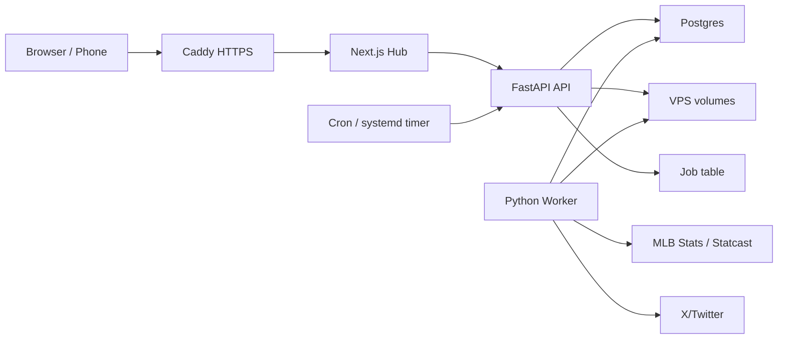

# MLB Ops VPS Production Spec

## Objective

Turn MLB Ops from a local dev stack into a stable production-style system on the VPS.

The desired user experience:

- open one URL from Mac, phone, or any browser
- see today’s generated drafts
- click buttons that start jobs without freezing the UI
- approve/edit/post content
- scheduled jobs run without opening the app
- generated images and queue state live on the server, not the laptop

## Current System

MLB Ops currently has these major pieces:

- Next.js Hub UI: `mlbops/hub`
- FastAPI API: `mlbops/api`
- SQLite state: `data/hub.db`
- generated images: `outputs/`
- MLB warehouse: `data/warehouse/mlb`
- card scripts: `scripts/*_daily.py`, `scripts/mallitalytics_daily_card.py`, `scripts/batter_card_daily.py`
- scheduled/remote workflows: `.github/workflows/daily_ingest.yml`, `.github/workflows/morning_intel.yml`
- morning intel: `morning_intel/morning_intel.py`

Current local sizes:

- warehouse: about 535 MB
- generated outputs: about 95 MB
- SQLite queue DB: about 1.9 MB

The VPS has enough room to host this if retention and backups are explicit.

## Main Architectural Mistakes

### 1. Local Machine Is The Production Server

The app depends on the Mac being awake, synced, hydrated, and running the right processes.

Impact:

- no stable URL
- no phone workflow
- every morning starts with operational work
- local DNS/filesystem/runtime issues block content creation

Fix:

- move production runtime to the VPS
- keep the Mac for development only

### 2. UI Clicks Run Heavy Work Inline

Several API routes run scripts directly via `subprocess.run`, then wait for completion.

Examples:

- `mlbops/api/routers/cards.py`
- `mlbops/api/routers/intel.py`

Impact:

- browser waits on Python work
- API threads get occupied
- timeouts look like freezes
- retries can duplicate work

Fix:

- UI creates a job
- worker runs the job
- UI polls/subscribes to job status

### 3. SQLite File Is Shared State

`data/hub.db` is used by FastAPI, Next.js API routes, jobs, and previous Google Drive sync.

Impact:

- file locking risk
- hard to deploy cleanly
- hard to access from multiple devices/servers
- no clean job history or worker concurrency

Fix:

- migrate control-plane state to Postgres on the VPS
- treat SQLite as a local-dev fallback only

### 4. Generated Assets Are Plain Local Files

Images are written to `outputs/` and served by FastAPI `/static`.

Impact:

- assets are tied to whichever machine generated them
- no durable metadata
- no lifecycle policy
- awkward migration/backups

Fix:

- keep files on VPS disk initially
- store metadata in Postgres
- later optional: move assets to object storage

### 5. Warehouse Is Queried On Demand

Some endpoints fall back to scanning raw feeds or many parquet files when fast artifacts are missing.

Examples:

- leaderboards can rebuild from raw feeds
- Insights can load full-season Statcast

Impact:

- tabs feel frozen
- expensive work happens during browsing
- missing precomputed files produce bad UX

Fix:

- daily scheduled jobs must produce fast artifacts
- API should fail fast with actionable status when artifacts are missing
- heavy aggregation belongs in worker/precompute

### 6. GitHub Actions, Drive, Local App, And Hub All Share Responsibilities

The same data is moved between GHA, Google Drive, local disk, and the Hub.

Impact:

- unclear source of truth
- stale state
- duplicated sync logic
- recurring “why is this missing?” debugging

Fix:

- source of truth on VPS:
  - Postgres for state
  - `/srv/mlbops/warehouse` for warehouse files
  - `/srv/mlbops/outputs` for generated assets
- GHA can stay as a backup or remote trigger, but not as the primary app runtime

## Target Architecture



## VPS Services

Use Docker Compose with these services:

### `proxy`

Recommended: Caddy.

Responsibilities:

- HTTPS
- route public traffic
- hide internal container ports

Public ports:

- `80`
- `443`

### `hub`

Next.js production server.

Responsibilities:

- Queue UI
- status pages
- content approval/editing
- mobile-friendly workflow

Internal only:

- `3000`

### `api`

FastAPI service.

Responsibilities:

- authenticated API
- queue endpoints
- job creation endpoints
- static asset serving
- health/readiness

Internal only:

- `8000`

### `worker`

Long-running Python worker.

Responsibilities:

- ingest jobs
- card generation jobs
- morning intel jobs
- uploads/asset metadata
- post-processing

Concurrency:

- start with 1 worker process
- increase only after jobs are stable

### `postgres`

Production DB.

Responsibilities:

- queue state
- job state
- watchlist
- metrics
- audit logs
- asset metadata

Internal only:

- `5432`, not public

### Optional `redis`

Not required at first.

Use only if Postgres job polling is not enough.

## VPS File Layout

Recommended host paths:

```text
/srv/mlbops/
  app/                 cloned repo
  env/                 production env files, not committed
  postgres/            Postgres volume
  warehouse/           MLB warehouse
  outputs/             generated card images/csvs
  logs/                app and worker logs
  backups/
    postgres/
    outputs/
    warehouse-manifests/
```

Container paths:

```text
/app
/data/warehouse/mlb
/outputs
```

## Database Tables Needed

Already drafted in `supabase/schema_drafts/001_mlbops_control_plane.sql`, but for VPS Postgres this should become a normal migration.

Core:

- `content_queue`
- `player_watchlist`
- `live_events`
- `post_performance`
- `twitter_metrics_snapshots`
- `notification_log`
- `security_audit_log`

New operational tables:

- `job_runs`
- `generated_assets`
- `warehouse_files`
- `daily_readiness`

## Job Model

All heavy work should use this lifecycle.

```text
queued -> running -> succeeded
                  -> failed
                  -> cancelled
```

Minimum `job_runs` columns:

- `id`
- `job_type`
- `status`
- `requested_for_date`
- `season`
- `stage`
- `created_by`
- `started_at`
- `finished_at`
- `duration_ms`
- `error_message`
- `output_queue_item_id`
- `meta_json`

Job types:

- `daily_ingest`
- `hr_tracker`
- `pitching_index`
- `games_of_day`
- `probables_board`
- `pitcher_card`
- `batter_card`
- `morning_intel`
- `leaderboard_precompute`
- `cleanup`
- `backup`

## Interactive Button Flow

Current bad pattern:

```text
Button click -> FastAPI runs Python script -> browser waits
```

Target pattern:

```text
Button click
  -> POST /jobs
  -> API inserts job_runs(status='queued')
  -> API returns { job_id }
  -> worker claims job
  -> worker runs script
  -> worker writes output
  -> worker inserts/updates content_queue
  -> worker marks job succeeded/failed
  -> UI polls /jobs/{id}
```

This is the single most important reliability improvement.

## Scheduled Jobs

Use cron or systemd timers on the VPS.

Initial schedule:

- 07:00 AST: ingest yesterday, retry previous 2 days
- 07:20 AST: validate warehouse readiness
- 07:25 AST: generate HR Tracker
- 07:27 AST: generate Pitching Index
- 07:30 AST: generate Games of Day / Probables
- 07:35 AST: run Morning Intel
- hourly during games: optional live event scan
- nightly: Postgres backup
- weekly: output/warehouse cleanup report

Each scheduled task should call the API or worker CLI to create a `job_runs` row first.

## Data Retention

VPS disk is 100 GB. Current usage is small enough, but retention must be explicit.

Recommended start:

- keep all current-season raw feeds
- keep all current-season `pitches_enriched`
- keep generated outputs for current season
- compress raw feeds as `.json.gz`
- archive or delete old temporary card retries
- keep daily Postgres backups for 14 days
- keep weekly backups for 8 weeks

Add a doctor check that warns when disk exceeds 70%.

## Deployment Phases

### Phase 0: Keep Local Usable

Already started.

- `scripts/mlbops_doctor.py`
- HR Tracker fast path
- Insights no longer auto-loads full Statcast
- daily ingest restored for recent dates

Acceptance:

- local launch reports clear readiness
- HR Tracker/Pitching Index generate under a few seconds when data exists

### Phase 1: Containerize Current App

Build Docker images:

- `api`
- `hub`
- `worker`

Keep SQLite initially if needed, but mount it as a volume.

Acceptance:

- `docker compose up -d`
- Hub opens through VPS URL
- API health passes
- Queue loads

### Phase 2: Move State To Postgres

Add DB adapter:

- `MLBOPS_DB_BACKEND=sqlite`
- `MLBOPS_DB_BACKEND=postgres`

Import current `hub.db`.

Acceptance:

- queue read/list/update uses Postgres
- watchlist uses Postgres
- no app code writes to `data/hub.db` in production

### Phase 3: Add Job Queue

Add:

- `job_runs` table
- `/jobs` API routes
- worker loop
- UI job status panel

Convert quick generators first:

- HR Tracker
- Pitching Index
- Games of Day
- Probables Board

Acceptance:

- button returns `job_id` immediately
- worker generates card
- UI updates without freezing

### Phase 4: Move Scheduled Jobs To VPS

Add cron/systemd timers.

Acceptance:

- morning ingest runs without GitHub/local action
- morning cards are in queue before login
- failure appears in `job_runs`, not only logs

### Phase 5: Production Hardening

Add:

- Caddy HTTPS
- non-root deploy user
- firewall
- backups
- restart policies
- log rotation
- disk alerts

Acceptance:

- app survives reboot
- database backup restore tested once
- services restart on crash

### Phase 6: Reduce Google Drive Dependency

Drive can remain backup initially.

Later:

- stop pulling Drive on startup
- stop pushing `hub.db`
- optionally backup warehouse/output to Drive or another remote

Acceptance:

- production app does not need Drive to work
- Drive outage does not block queue/cards

## What Not To Do

- Do not deploy the current local app as-is and call it production.
- Do not use browser clicks for long-running scripts.
- Do not expose Postgres publicly.
- Do not run all jobs concurrently.
- Do not move warehouse parquet data into Postgres.
- Do not make Supabase/Vercel mandatory before using the VPS.

## Open Questions

- Domain/subdomain to use for the Hub.
- Whether Hermes AI already uses Docker/Caddy on the VPS.
- Whether MLB Ops should be public behind password or private behind Tailscale.
- Whether X/Twitter posting should happen from the VPS immediately or stay manual at first.
- Backup destination: Google Drive, local download, or another object store.

## First Build Slice

The smartest first slice is not “deploy everything.”

Build this first:

1. Docker Compose with `proxy`, `hub`, `api`, `postgres`.
2. Import `hub.db` into Postgres.
3. Queue page reads/writes Postgres.
4. Static outputs served from VPS volume.
5. Manual card generation still works.

Then add the worker/job system.

This keeps risk low while removing the biggest source of friction: the Mac as production.

