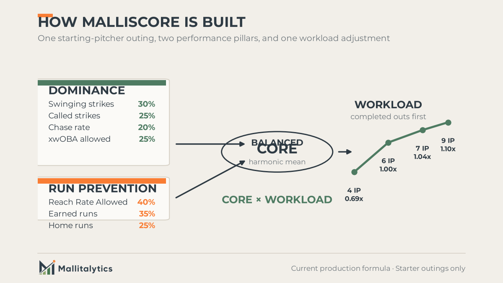
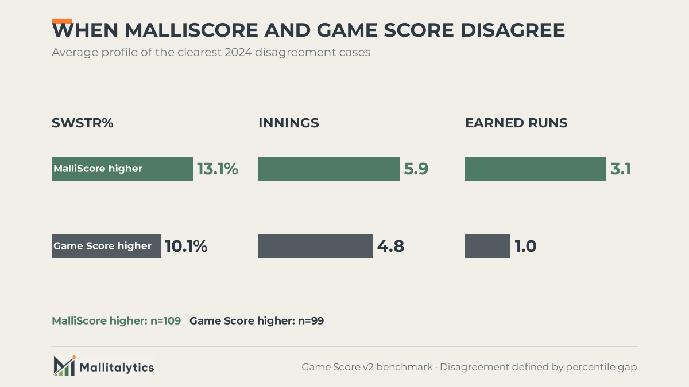
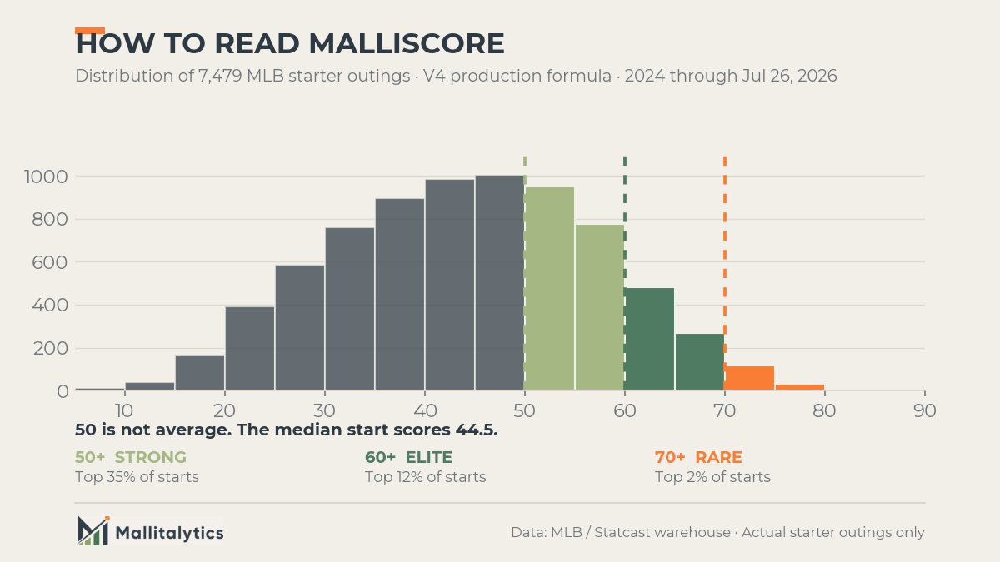

Two starts, identical down to the strikeout.

On May 18, 2024, Shota Imanaga went seven innings against Pittsburgh: four hits, one walk, no runs, seven strikeouts. Two months later, Michael Wacha produced the same line against the White Sox. Seven innings, four hits, one walk, no runs, seven strikeouts.

Game Score rates both outings 79. It should. The lines are the same.

But the games inside those lines were not. Imanaga missed bats on 25.0% of his pitches and induced chases 42.5% of the time. Wacha posted an 8.4% swinging-strike rate and a 16.3% chase rate. Imanaga repeatedly removed contact from the equation. Wacha commanded the zone, managed contact, and reached the same clean result by another route.

I built MalliScore from a simple baseball belief: a pitcher who can make hitters miss controls a part of the game that defense and batted-ball fortune cannot give him. Run prevention still matters, because dominance without results is incomplete. But when two pitchers produce the same line, I want the score to recognize which one took more of the outcome into his own hands.

**Dominance can produce run prevention. Run prevention does not prove dominance.**

That distinction is the reason MalliScore exists. It asks three questions about one start: What did the pitcher control? What damage did he allow? How much of the game did he carry?

## What the box score misses

A pitching line, or a number built from it, can summarize the quality of a start. That is useful. It is why Bill James created Game Score and why Tom Tango later updated it.

[Game Score](https://library.fangraphs.com/pitching/game-score/) gives us a compact reading of workload and results: outs, strikeouts, hits, walks, and runs. The [updated version](https://www.mlb.com/glossary/advanced-stats/game-score) accounts more directly for home runs. It answers a familiar question: **How good was the pitcher's line?**

What it cannot do is separate Imanaga from Wacha. On the dimensions Game Score reads, there is nothing to separate.

That does not make Game Score wrong. It reveals a second question. Did the pitcher prevent runs by overpowering the lineup, by controlling contact, or through some combination of both?

MalliScore is designed as a second opinion on that question, not a replacement for the box score.

## What MalliScore measures

MalliScore is a **0-to-100 descriptive index of one starting-pitcher outing**. It is not a season rating, a projection, or a measure of true talent.

It evaluates the completeness of the performance through two pillars and a workload adjustment:

1. Dominance: how forcefully the pitcher controlled plate appearances.
2. Run Prevention: how effectively he kept runners and runs off the board.
3. Workload: how much of the game he completed.

The study sample contains 7,479 starter outings from available raw feeds: 1,908 in 2024, 2,520 in 2025, and 3,051 in 2026 through July 26. Coverage in 2024 and 2025 is incomplete and non-random, so these are sample benchmarks rather than claims about every MLB start in those seasons.

Across that sample, the median MalliScore was **44.5**. The top 10 percent began in the low 60s and the top 1 percent around 73. The highest observed score was **87.4**, recorded by Jacob Misiorowski on June 12, 2026. The 100-point ceiling is theoretical, not an expectation for a normal start.

### Dominance

The Dominance pillar uses:

- **Swinging-strike rate: 30%**
- **Called-strike rate: 25%**
- **Chase rate: 20%**
- **xwOBA allowed: 25%**, where lower is better

Swinging strikes, called strikes, and chases describe active control of the plate appearance. They show the pitcher beating the hitter before a ball in play can involve positioning, defense, park effects, or batted-ball fortune.

That is not the only way to pitch well. Ground-ball and weak-contact pitchers can dominate games without collecting extreme whiff totals. MalliScore still credits their clean results in Run Prevention. The Dominance pillar is deliberately narrower because it asks whether the pitcher controlled the plate appearance through strikes, chases, and missed bats.

The current formula also includes xwOBA allowed in Dominance to credit contact suppression. That makes the pillar broader than pure bat-missing. The validation study identified its placement as an open design question because xwOBA can also be understood as a Run Prevention input. The production formula keeps it here for now rather than hiding that tension.

Why emphasize these process indicators at all? We split each qualifying pitcher-season into alternating starts, then compared the averages from both groups. A higher value means the measure appeared more consistently across that pitcher's season.

| Measure | Consistency across alternating starts |
|---|---:|
| Swinging-strike rate | .775 |
| Chase rate | .640 |
| Called-strike rate | .610 |
| xwOBA allowed | .493 |
| Earned runs | .348 |
| Home runs | .211 |

The test covered 434 pitcher-seasons with at least eight starts. A .775 value for swinging-strike rate means pitchers who generated more whiffs in one set of starts generally did so in the other. Earned runs and home runs repeated much less consistently.

**This supports using dominance to describe how much of an outing the pitcher controlled. It does not establish that one high-dominance start predicts the next one.**

### Run Prevention

The Run Prevention pillar uses:

- **Reach Rate Allowed: 40%**
- **Earned runs: 35%**
- **Home runs: 25%**

Reach Rate Allowed is:

```text
RRA = (H + BB + HBP) / BF
```

It measures the share of batters who reached through a hit, walk, or hit-by-pitch. MalliScore uses batters faced as the opportunity denominator because WHIP can become unstable when innings pitched is very small. This is a design choice for a single-start index, not an argument that RRA should replace WHIP everywhere.

Run Prevention does not care whether the pitcher escaped through strikeouts, weak contact, sequencing, or defense. It records that the traffic and damage were limited. That is why dominance can contribute to run prevention, while a clean run-prevention result cannot by itself prove dominance.

### Workload

Completed outs are the main workload signal. They multiply the combined pillar score:

- Four innings receives a **0.69** multiplier.
- Six innings is essentially neutral at **1.00**.
- Seven innings receives **1.04** and nine innings **1.10**.
- Pitch efficiency can move the adjustment only slightly.

The asymmetry is intentional. Falling two innings short of six costs much more than extending three innings beyond six can add. Length matters, but a pitcher cannot buy a great MalliScore with innings after allowing substantial damage.

## How the score works

Each input is compared with an empirical baseline from 2024 starting-pitcher outings. The distance from that baseline is expressed in standard deviations, with lower-is-better statistics reversed.

The listed percentages are applied **after standardization**. MalliScore does not multiply a raw 12.9% swinging-strike rate by 30%. It first determines how far that outing sits above or below the baseline, then applies the weight on that common scale.

The weighted inputs become two 0-to-100 pillars:

```text
Dominance = clamp(50 + 15 x weighted dominance z-score, 0, 100)

Run Prevention = clamp(50 + 15 x weighted run-prevention z-score, 0, 100)
```

A baseline outing sits at 50. Every standard deviation above or below the baseline moves the pillar 15 points.

The pillars are combined with a harmonic mean:

```text
Core = (2 x Dominance x Run Prevention) / (Dominance + Run Prevention)

MalliScore = clamp(Core x Workload, 0, 100)
```

The harmonic mean makes balance matter. Whiffs cannot fully hide poor run prevention, and a clean scoreboard cannot completely hide a lack of control. The weaker pillar pulls the score down.



## Same line, different performance

Now return to Imanaga and Wacha:

| | Imanaga, May 18 | Wacha, Jul 19 |
|---|---:|---:|
| Line | 7.0 IP, 4 H, 1 BB, 0 ER, 7 K | 7.0 IP, 4 H, 1 BB, 0 ER, 7 K |
| Game Score v2 | 79 | 79 |
| Swinging strikes | 25.0% | 8.4% |
| Chase rate | 42.5% | 16.3% |
| Called strikes | 14.8% | 20.0% |
| xwOBA allowed | .262 | .236 |
| Dominance | 69.4 | 49.3 |
| Run Prevention | 68.9 | 68.0 |
| Workload | 1.04 | 1.04 |
| **MalliScore** | **72.2** | **59.5** |


Run Prevention is nearly identical, as the matching lines suggest it should be. Workload is identical. The 12.7-point MalliScore gap comes almost entirely from Dominance.

Wacha still pitched an excellent game. He allowed lower xwOBA than Imanaga and collected more called strikes. His path relied more on command and contact management. Imanaga paired the same result with a swinging-strike rate three times as high and a chase rate more than twice as high.

MalliScore places Imanaga's start in the top 2 percent of the study sample and Wacha's in the top 13 percent. Both are strong outings. Imanaga receives additional credit because he supplied clearer evidence of active lineup control.

That is a descriptive judgment about these games. It is not a forecast of either pitcher's next start or career ceiling.

## What the validation found

MalliScore and Game Score should agree most of the time, and they do. Their season-level rank correlations in the study ranged from .925 to .938. Both reward good, deep starts.

The difference appeared in reliability. We again split pitcher-seasons into alternating starts and asked whether each score told a similar story across both groups. Across 367 pitcher-seasons with at least 10 starts, MalliScore reached **.604**, compared with **.467** for Game Score v2. The paired difference was **+.137**, with a 95% confidence interval from **+.088 to +.198**.

Reliability is not accuracy. It does not prove that MalliScore is the correct verdict on every start. It means the measure held together more consistently across a pitcher's season in this sample.

The disagreement cases show what each index values:

- **MalliScore-favored starts** averaged a 12.9% swinging-strike rate, 5.9 innings, and 3.2 earned runs.
- **Game Score-favored starts** averaged a 10.4% swinging-strike rate, 4.7 innings, and 1.1 earned runs.



MalliScore tends to prefer the longer, more dominant outing that allowed some damage. Game Score tends to prefer the shorter, lower-whiff outing that kept runs off the board.

Neither preference is universally correct. Their disagreement creates the useful question: **Was this start impressive because of the result, or because of the way the pitcher controlled the game?**

We also tested 20,000 feasible weight combinations on the 2024 development sample. Every version retained at least a .963 Spearman rank correlation with the production formula, and 97% exceeded .980. The rankings were not fragile to reasonable weight changes. The more important choices were architectural: which inputs belong, how they are normalized, and how workload interacts with the two pillars.

## What MalliScore cannot tell us

MalliScore does **not** predict the next start.

After controlling for recent form, it added no meaningful next-start information for swinging-strike rate, xwOBA allowed, strikeout-minus-walk rate, or WHIP. Game Score added no meaningful signal either. The tests were precise enough to rule out an effect worth acting on.

That result defines the metric rather than weakening it. MalliScore describes the performance that just happened. It should not be used as a fantasy projection, a rest-of-season forecast, or proof that a pitcher established a new talent level.

The study also tested the tempting belief behind the score: that more missed bats in one outing should guarantee a higher future floor or ceiling. The evidence did not support that stronger claim after accounting for broader run prevention. MalliScore therefore rewards dominance because it reveals **how this outing was controlled**, not because one dominant start promises the next one.

Other limits remain:

- The empirical baselines were developed on 1,908 available starts from 2024.
- Coverage in 2024 and 2025 is incomplete and non-random.
- The score applies to starters. Relievers require different workload expectations.
- Completed outs are a substantial and intentional part of the definition.
- xwOBA allowed may fit more naturally in Run Prevention than Dominance.
- Soft-contact specialists can prevent runs without matching the profile MalliScore most rewards.

These are not caveats to bury. They define where the score is useful and where it stops.

## How to read MalliScore

Do not read MalliScore like a school grade. A 50 is not average, because the 100-point ceiling is theoretical and most starts do not combine strong dominance, clean run prevention, and deep workload.

Across the 7,479-start V4 study sample, the median score was **44.5**. The practical bands are:

| MalliScore | Where it sits in the study sample | Practical read |
|---|---:|---|
| Below 50 | Outside the top 35% | A less complete start, often because of limited workload, damage, or one weaker pillar. |
| 50 to 59 | Top 35% to 12% | A strong start. The pitcher was above the typical outing on the complete MalliScore view. |
| 60 to 69 | Top 12% to 2% | An elite start. Strong result, strong process, and meaningful workload usually came together. |
| 70 or higher | Top 2% | Rare territory. This is the kind of complete outing that stands out across a full season. |



The overall score gives the level. The two pillars give the reason. A 62 built on excellent Run Prevention but average Dominance tells a different baseball story from a 62 built on overwhelming bat-missing and merely solid run prevention.

## What MalliScore adds

MalliScore does not turn a start into a final answer. Its value is giving the reader a better first question.

For a curious baseball fan, it makes the box score less flat. A 7.0-inning, zero-run line can come from a pitcher overpowering hitters, from a pitcher managing contact, or from a blend of both. MalliScore helps show which kind of game you watched.

For a fantasy manager in a roto or head-to-head categories league, MalliScore puts the three parts of a useful start in one place: workload, missed bats, and run prevention. Those are the forces behind innings and quality starts, strikeouts, and the ERA-WHIP side of the ledger. It does not replace a projection or tell you whom to start tomorrow. It helps you judge how much meaning to assign to yesterday's line. A high score after a merely decent box score can identify a performance that delivered workload and bat-missing despite some damage. A clean line with a lower score is still valuable, but it may have been driven more by the result than by active control of the plate appearance.

For anyone following baseball every day, the score gives a consistent way to compare performances that otherwise look similar on the surface. It adds context to a great line, and it adds texture to a disappointing one.

**That is MalliScore's job: make the completed game more legible without pretending to predict the next one.**

Game Score asks how good the line was. MalliScore asks how the performance was built. Baseball has room for both questions.

---

**Method note:** The study used 7,479 MLB starting-pitcher outings from available raw feeds: 1,908 from 2024 for development, 2,520 from 2025 for validation, and 3,051 from 2026 through July 26 for confirmation. Reliability, agreement, and disagreement figures were computed on the current production formula across that window. The weight-sensitivity test used the 2024 development sample. Data came from the Mallitalytics MLB and Statcast warehouse. This article describes the production formula for actual outings as of August 2026.
