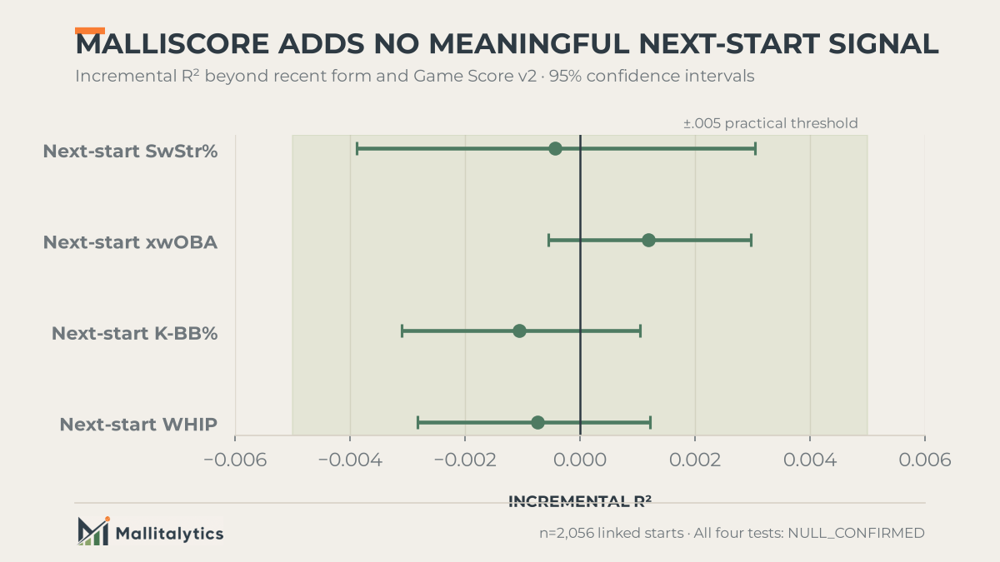

Two pitching performances can both be bad without being the same kind of bad.

On July 6, 2024, Lance Lynn allowed 10 earned runs in 2.2 innings. Three months earlier, Blair Henley recorded one out while allowing five earned runs in his major-league debut.

The box score tells us both starts went badly. But they did not fail in the same way, and they did not ask the same thing of the pitcher. One lasted eight outs. The other lasted one. A useful single-game score should preserve that difference while still asking a larger question: **What did this pitcher control, what damage did he allow, and how much of the game did he carry?**

## The box score is useful. It is also incomplete.

The conventional view says a pitching line, or a single number built from that line, can summarize the quality of a start. That view is useful. It is why Bill James created Game Score and why Tom Tango later updated it.

[Game Score](https://library.fangraphs.com/pitching/game-score/) gives us a compact reading of workload and results: outs, strikeouts, hits, walks, and runs. The [updated version](https://www.mlb.com/glossary/advanced-stats/game-score) also accounts more directly for home runs. It remains an intuitive answer to a familiar question: **How good was the pitcher's line?**

But the same line can be produced through very different performances.

A pitcher can miss bats, force chases, and suppress dangerous contact while still allowing three runs. Another can record fewer whiffs, work only five innings, and escape without allowing a run. The box score tells us the result. It does not fully tell us how the pitcher controlled the game.

That is the missing layer MalliScore was built to examine.

> **The conventional view says the pitching line summarizes the start. That misses how the pitcher created the result. The evidence shows that dominance, run prevention, and workload provide a reliable second opinion. This matters because the disagreement tells us something the line alone cannot.**

## What MalliScore measures

MalliScore is a **0-to-100 descriptive index of one starting-pitcher outing**. It is not a season rating, a projection, or a measure of true talent.

It asks a narrower question:

> How complete was this pitching performance when we consider dominance, run prevention, and the amount of the game the pitcher carried?

The score has two performance pillars and one workload adjustment.

### 1. Dominance

Dominance measures how forcefully the pitcher controlled plate appearances:

- **Swinging-strike rate: 30%**
- **Called-strike rate: 25%**
- **Chase rate: 20%**
- **xwOBA allowed: 25%**, where lower is better

Swinging strikes and called strikes are not interchangeable. In the validation data, they were negatively correlated. Some pitchers win by generating empty swings. Others steal strikes through location, movement, or sequencing. MalliScore keeps both paths visible.

xwOBA allowed adds the quality of the contact and plate-appearance outcomes the pitcher surrendered. Its placement in a pillar named "dominance" is contestable, and the validation study identified it as the strongest design question for a future version.

### 2. Run prevention

Run prevention measures the damage that reached the scoreboard or threatened to reach it:

- **Reach Rate Allowed: 40%**
- **Earned runs: 35%**
- **Home runs: 25%**

Reach Rate Allowed is:

```text
RRA = (H + BB + HBP) / BF
```

It answers a direct question: **What share of the batters faced reached through a hit, walk, or hit-by-pitch?**

MalliScore uses RRA rather than WHIP because WHIP divides by innings pitched. In a very short outing, that denominator can become unstable. Batter faced is the cleaner opportunity denominator for this specific job: measuring how often a pitcher allowed a hitter to reach during the opportunities he faced. This is not an argument that RRA should replace WHIP everywhere.

### 3. Workload

Completed outs are the main workload signal.

- Four innings receives a clear penalty.
- Six innings receives approximately neutral credit.
- Outs beyond six add a limited bonus.
- Pitch efficiency can move the workload adjustment only slightly.

This is deliberate. MalliScore evaluates a **complete starting-pitcher performance**, so recording more outs matters. It should matter without allowing raw pitch count or efficiency to dominate the score.

## How the formula works

Each input is compared with an empirical league baseline from 2024 starting-pitcher outings. The distance from that baseline is expressed in standard deviations, with lower-is-better statistics reversed.

The weighted inputs become two 0-to-100 pillar scores centered around 50:

```text
Dominance = clamp(50 + 15 x weighted dominance z-score, 0, 100)

Run Prevention = clamp(50 + 15 x weighted run-prevention z-score, 0, 100)
```

The two pillars are joined with a harmonic mean:

```text
Core = (2 x Dominance x Run Prevention) / (Dominance + Run Prevention)

MalliScore = clamp(Core x Workload, 0, 100)
```

The harmonic mean makes balance matter. A pitcher cannot completely hide poor run prevention behind whiffs, or a low-whiff outing behind a clean scoreboard. The weaker pillar pulls the core score down.

The 100-point ceiling is theoretical, not a target we expect normal starts to reach.


## A real MalliScore example

On August 2, 2026, Matthew Liberatore faced Toronto and produced this line:

```text
6.0 IP | 1 H | 1 BB | 0 HBP | 0 ER | 0 HR | 7 K | 85 pitches
```

He faced 20 batters, so his Reach Rate Allowed was:

```text
(1 H + 1 BB + 0 HBP) / 20 BF = .100
```

His process indicators added more detail:

- 12.9% swinging-strike rate
- 20.0% called-strike rate
- 39.6% chase rate
- .148 xwOBA allowed

Those inputs produced a **66.3 Dominance score** and a **73.8 Run Prevention score**. Their harmonic mean was 69.8. Six innings and 85 pitches supplied a nearly neutral 1.003 workload adjustment.

**Final MalliScore: 70.0.**

The interpretation is more useful than the number by itself. Liberatore did not earn the score only because he allowed no runs. He paired the clean line with above-baseline called strikes, chases, and contact suppression while completing six innings.

## Why these weights are not treated as perfect truth

MalliScore's weights are informed choices, not statistically unique truths. That distinction matters.

To test whether they were driving the rankings, I evaluated **20,000 alternative weight combinations** across the feasible range. Rank agreement with the baseline MalliScore formula never fell below a Spearman correlation of .963. Ninety-seven percent of the combinations agreed above .98.

In practical terms, many reasonable weighting systems produced almost the same ordering. Pretending the data had discovered one perfect set of weights would have created false precision.


That does not mean every design choice is settled. The current model uses empirical league baselines, and it deliberately makes workload a modest adjustment rather than a third equal pillar. xwOBA allowed also remains a live design question: it measures the contact and outcomes allowed, so there is a reasonable case for placing it inside Run Prevention rather than Dominance.

## MalliScore is a second opinion, not a Game Score replacement

Any new pitching index should be tested against the strongest familiar alternative.

Across the study, MalliScore and Game Score v2 agreed strongly. Their season-level rank correlations ranged from .926 to .939. That is expected: both reward good, deep starts.

The interesting information appears when they disagree.

Among the clearest disagreement cases:

- **MalliScore-favored starts** averaged a 13.1% swinging-strike rate, 17.8 outs, and 3.1 earned runs.
- **Game Score-favored starts** averaged a 10.1% swinging-strike rate, 14.4 outs, and 1.0 earned run.


MalliScore tends to prefer the longer, more dominant start that allowed some damage. Game Score tends to prefer the shorter, lower-whiff start that kept runs off the board.

Neither preference is universally correct. The disagreement answers the real editorial question: **Was this start impressive because of the result, or because of the way the pitcher controlled the game?**

Across a split-half test, MalliScore showed a **+.115 reliability advantage over Game Score v2**, with a paired 95% confidence interval of +.069 to +.172. Reliability here means that a pitcher's score was more consistent from one half of his starts to the other. It does not mean MalliScore is more accurate in every baseball sense.

## What MalliScore cannot tell us

MalliScore does **not** predict the next start.

After controlling for a pitcher's recent form, it added no meaningful next-start information for swinging-strike rate, xwOBA allowed, strikeout-minus-walk rate, or WHIP. Game Score added no meaningful signal either.



That is not a failed result. It defines the metric correctly.

MalliScore describes the performance that just happened. It should not be used as a rest-of-season projection, a fantasy forecast, or proof that a pitcher has established a new talent level.

The validation also leaves real limitations:

- The empirical baselines were developed on 1,908 starts from 2024.
- Earned-run coverage was incomplete and non-random for portions of 2024 and 2025.
- The study includes starters only; relievers need different workload expectations.
- Completed outs correlate strongly with MalliScore. Length is a substantial and intentional part of the definition.
- xwOBA allowed may fit more naturally inside Run Prevention than Dominance. That remains an open design question.
- Two predictive comparisons with Game Score were underpowered and cannot support a conclusion.

Those are not footnotes to hide. They define where the score is useful and where it stops.

## What to watch when MalliScore appears

The purpose of MalliScore is not to end the conversation with one number. It is to help start the right one.

When the score agrees with the box score, the outing probably combined process, result, and workload in the expected way.

When MalliScore is higher than the traditional line suggests, look for whiffs, called strikes, chases, contact suppression, and depth. The pitcher may have controlled more of the game than the runs imply.

When MalliScore is lower, look for a clean result supported by fewer missed bats, fewer outs, or more traffic than the scoreboard reveals.

Game Score asks how good the line was. MalliScore asks how the performance was built.

Baseball is more interesting when we keep both questions.

---

**Method note:** The validation used 7,479 MLB starting-pitcher outings: 1,908 from 2024 for development, 2,520 from 2025 for validation, and 3,051 from 2026 through July 26 for confirmation. Data came from the Mallitalytics MLB and Statcast warehouse. This article describes the current production formula for actual outings as of August 2026.
