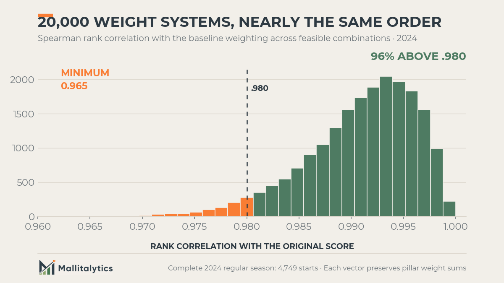

Two starts, identical down to the strikeout.

On May 18, 2024, Shota Imanaga went seven innings against Pittsburgh: four hits, one walk, no runs, seven strikeouts. Two months later, Michael Wacha did precisely the same thing to the White Sox. Seven innings, four hits, one walk, no runs, seven strikeouts.

Game Score rates both outings 79. It should. The lines are the same.

But look at what happened inside them. Imanaga missed bats on a quarter of his pitches and got Pittsburgh to chase 42.5% of the time. Wacha's figures were 8.4% and 16.3%. Imanaga repeatedly took the bat out of Pittsburgh's hands. Wacha managed contact, commanded the zone, and kept the same clean result on the board.

Same result. Different path to it. That is the reason MalliScore exists: **What did this pitcher control, what damage did he allow, and how much of the game did he carry?**

## The box score is useful. It is also incomplete.

A pitching line, or a single number built from that line, can summarize the quality of a start. That view is useful. It is why Bill James created Game Score and why Tom Tango later updated it.

[Game Score](https://library.fangraphs.com/pitching/game-score/) gives us a compact reading of workload and results: outs, strikeouts, hits, walks, and runs. The [updated version](https://www.mlb.com/glossary/advanced-stats/game-score) also accounts more directly for home runs. It remains an intuitive answer to a familiar question: **How good was the pitcher's line?**

What it cannot do is separate Imanaga from Wacha, because on the dimensions Game Score reads, there is nothing to separate. The box score tells us the result. It does not tell us how the pitcher produced it.

That is the missing layer MalliScore was built to examine. It is not a claim that every strong start must look like Imanaga's. Contact managers can be excellent pitchers and can produce excellent starts. The point is narrower: a clean result and active control of the lineup are related, but they are not interchangeable.

## What MalliScore measures

MalliScore is a **0-to-100 descriptive index of one starting-pitcher outing**. It is not a season rating, a projection, or a measure of true talent.

It asks a narrower question:

> How complete was this pitching performance when we consider dominance, run prevention, and the amount of the game the pitcher carried?

Before the formula, the scale. In this article, the **study sample** means 7,479 starter outings drawn from available raw feeds: 1,908 in 2024, 2,520 in 2025, and 3,051 in 2026 through July 26. The 2024 and 2025 coverage is incomplete and non-random, so these are sample benchmarks, not claims about every MLB start in those seasons.

Across that sample, the median outing scored **44.5**. A score in the low 60s puts a start in the top 10 percent; the top 1 percent begins around 73. The highest observed score was **87.4**, recorded by Jacob Misiorowski on June 12, 2026. Nobody in the sample approached 100, and nobody is supposed to.

The score has two performance pillars and one workload adjustment.

### 1. Dominance

Dominance measures how forcefully the pitcher controlled plate appearances:

- **Swinging-strike rate: 30%**
- **Called-strike rate: 25%**
- **Chase rate: 20%**
- **xwOBA allowed: 25%**, where lower is better

There are two valid ways to prevent runs. A pitcher can limit the quality and volume of contact, often with ground balls, command, and weak contact. Or he can reduce the hitter's opportunity to put the ball in play at all, through whiffs, called strikes, and chases.

Run Prevention recognizes either route when it keeps runners and runs off the board. Dominance is deliberately narrower. It measures the second route: whether the pitcher actively powered through plate appearances. That is why it gets its own half of the score instead of being hidden inside the final line.

Swinging strikes and called strikes are not interchangeable. Across pitcher-seasons they trade off, correlating at −.39. Some pitchers win by generating empty swings. Others steal strikes through location, movement, or sequencing; Wacha's start above is what that second path looks like. MalliScore keeps both visible.

There is a reason this half of the score exists at all. We split each qualifying pitcher-season into alternating starts, then compared the averages from the two groups. Higher values mean the measure showed up more consistently across that pitcher's season.

| Measure | Consistency across alternating starts |
|---|---|
| Swinging-strike rate | .775 |
| Chase rate | .640 |
| Called-strike rate | .610 |
| xwOBA allowed | .493 |
| Earned runs | .348 |
| Home runs | .211 |

For example, a .775 swinging-strike value means pitchers who generated more whiffs in one set of starts generally did so in the other. Runs and home runs were much less consistent in the same test. The comparison includes 434 pitcher-seasons with at least eight starts.

Half of MalliScore is built from the part of an outing least likely to be luck. That is the half a box score barely records.

xwOBA allowed adds the quality of the contact and plate-appearance outcomes the pitcher surrendered. It measures the damage allowed rather than the pressure applied, so there is a reasonable case for placing it in Run Prevention instead. We have left it in Dominance for now, and the validation study flagged it as the strongest open design question.

### 2. Run prevention

Run prevention measures the damage that reached the scoreboard or threatened to reach it:

- **Reach Rate Allowed: 40%**
- **Earned runs: 35%**
- **Home runs: 25%**

Reach Rate Allowed is:

```text
RRA = (H + BB + HBP) / BF
```

It answers a direct question: **What share of the batters faced reached through a hit, walk, or hit-by-pitch?**

MalliScore uses RRA rather than WHIP because WHIP divides by innings pitched. In a very short outing, that denominator can become unstable. Batters faced is the cleaner opportunity denominator for this specific job: measuring how often a pitcher allowed a hitter to reach during the opportunities he faced. This is not an argument that RRA should replace WHIP everywhere.

### 3. Workload

Completed outs are the main workload signal, applied as a multiplier on the rest of the score:

- Four innings multiplies the score by **0.69**.
- Six innings is essentially neutral at **1.00**.
- Seven innings earns **1.04**, nine innings **1.10**.
- Pitch efficiency can move the adjustment only slightly.

Note the asymmetry. Falling two innings short of six costs roughly a third of the score. Going three innings beyond six returns about a tenth. MalliScore evaluates a **complete starting-pitcher performance**, so recording more outs matters, but a pitcher cannot buy his way to a great score on length alone.

## How the formula works

Each input is compared with an empirical league baseline from 2024 starting-pitcher outings. The distance from that baseline is expressed in standard deviations, with lower-is-better statistics reversed.

The listed weights are applied **after** that standardization. MalliScore does not multiply a raw 12.9% swinging-strike rate by 30%; it first asks how far 12.9% sits above or below the league baseline, then gives that standardized result 30% of the Dominance pillar.

The weighted inputs become two 0-to-100 pillar scores:

```text
Dominance = clamp(50 + 15 x weighted dominance z-score, 0, 100)

Run Prevention = clamp(50 + 15 x weighted run-prevention z-score, 0, 100)
```

Read that as a simple rule: a league-average outing sits at 50, and every standard deviation above or below moves the pillar 15 points.

The two pillars are joined with a harmonic mean:

```text
Core = (2 x Dominance x Run Prevention) / (Dominance + Run Prevention)

MalliScore = clamp(Core x Workload, 0, 100)
```

The harmonic mean makes balance matter. A pitcher cannot completely hide poor run prevention behind whiffs, or a low-whiff outing behind a clean scoreboard. The weaker pillar pulls the core score down.


## A real MalliScore example

On August 2, 2026, Matthew Liberatore faced Toronto and produced this line:

```text
6.0 IP | 1 H | 1 BB | 0 HBP | 0 ER | 0 HR | 7 K | 85 pitches
```

He faced 20 batters, so his Reach Rate Allowed was:

```text
(1 H + 1 BB + 0 HBP) / 20 BF = .100
```

His process indicators added more detail. These are the raw outing statistics, not the weighted inputs themselves. MalliScore compares each one with its league baseline first, then applies the weights on that common standardized scale:

- 12.9% swinging-strike rate
- 20.0% called-strike rate
- 39.6% chase rate
- .148 xwOBA allowed

Those inputs produced a **66.3 Dominance score** and a **73.8 Run Prevention score**. Their harmonic mean was 69.8. Six innings and 85 pitches supplied a nearly neutral 1.003 workload adjustment.

**Final MalliScore: 70.0**, a score that would have ranked in the top 2 percent of starts in this study sample.


The interpretation is more useful than the number by itself. Liberatore did not earn the score only because he allowed no runs. He paired the clean line with above-baseline called strikes, chases, and contact suppression while completing six innings.

## Back to Imanaga and Wacha

Now the two starts we opened with, run through the same formula:

| | Imanaga, May 18 | Wacha, Jul 19 |
|---|---|---|
| Line | 7.0 IP, 4 H, 1 BB, 0 ER, 7 K | 7.0 IP, 4 H, 1 BB, 0 ER, 7 K |
| Game Score v2 | 79 | 79 |
| Swinging strikes | 25.0% | 8.4% |
| Chase rate | 42.5% | 16.3% |
| Called strikes | 14.8% | 20.0% |
| xwOBA allowed | .262 | .236 |
| Dominance | 69.4 | 49.3 |
| Run prevention | 68.9 | 68.0 |
| Workload | 1.04 | 1.04 |
| **MalliScore** | **72.2** | **59.5** |


Run prevention is nearly identical, which is what identical lines should produce. Workload is identical. The entire 12.7-point gap comes from Dominance: Imanaga's swinging-strike rate was three times Wacha's, and his chase rate was more than double.

Note what the table does not say. Wacha was not worse. He allowed *softer* contact than Imanaga, .236 against .262, and stole more called strikes, 20.0% against 14.8%. He pitched a genuinely excellent game by managing contact and commanding the zone. Imanaga pitched a different excellent game by making Pittsburgh miss.

MalliScore puts Imanaga's start in the top 2 percent of the study sample and Wacha's in the top 13 percent. Both are very good outings. Imanaga receives additional credit because he paired the result with the clearest evidence of active lineup control. That is a descriptive judgment about this game, not a forecast of either pitcher's next start or career ceiling.

The reverse case exists too. On July 6, 2024, Lance Lynn allowed 10 earned runs in 2.2 innings; three months earlier, Blair Henley recorded one out while allowing five in his debut. Game Score separates those by 32 points. MalliScore rates them 11.4 and 11.2, a tie at the floor, because Lynn's extra outs bought workload credit that his ten runs immediately spent. Length is credit, not absolution.

Same line, different score. Different line, same score. In both directions, MalliScore is reading an axis the box score does not.

## MalliScore is a second opinion, not a Game Score replacement

Any new pitching index should be tested against the strongest familiar alternative.

Across the study, MalliScore and Game Score v2 agreed strongly. Their season-level rank correlations ran from .925 to .938. That is expected: both reward good, deep starts.

On the reliability test, though, they separate. We use the same alternating-start comparison to ask whether each score tells a similar story across a pitcher's season, rather than amplifying single-game noise. Across 367 pitcher-seasons with at least 10 starts, MalliScore scored **.604 against Game Score v2's .467**, a paired advantage of **+.137 with a 95% confidence interval of +.088 to +.198**.

Reliability is not accuracy. It does not mean MalliScore is more correct about any individual start. It means the number holds together better from one half of a season to the other.

The mechanism is the table from earlier. Game Score is built almost entirely from the volatile column: runs, hits, walks, home runs. MalliScore gives half its weight to the stable one.

The more interesting information appears when the two scores disagree.

- **MalliScore-favored starts** averaged a 12.9% swinging-strike rate, 5.9 innings, and 3.2 earned runs.
- **Game Score-favored starts** averaged a 10.4% swinging-strike rate, 4.7 innings, and 1.1 earned runs.


MalliScore tends to prefer the longer, more dominant start that allowed some damage. Game Score tends to prefer the shorter, lower-whiff start that kept runs off the board.

Neither preference is universally correct. The disagreement answers the real editorial question: **Was this start impressive because of the result, or because of the way the pitcher controlled the game?**

## Why these weights are not treated as perfect truth

MalliScore's weights are informed choices, not statistically unique truths. That distinction matters.

To test whether they were driving the rankings, we re-weighted the same inputs **20,000 different ways** across the feasible range and rescored all 1,908 starts of the 2024 development season. Rank agreement with the baseline formula never fell below a Spearman correlation of .963. Ninety-seven percent of the combinations agreed above .98.

In practical terms, many reasonable weighting systems produced almost the same ordering. Pretending the data had discovered one perfect set of weights would have created false precision.



That robustness cuts both ways. It means the score is not fragile to a defensible change in the weights. It also means the weights are not where the interesting design questions live. Those sit in the architecture: which league baselines to use, whether workload belongs as a multiplier rather than a third pillar, and where xwOBA allowed truly belongs.

## What MalliScore cannot tell us

MalliScore does **not** predict the next start.

After controlling for a pitcher's recent form, it added no meaningful next-start information for swinging-strike rate, xwOBA allowed, strikeout-minus-walk rate, or WHIP. Game Score added no meaningful signal either. All four tests were tight enough to rule out an effect worth acting on, rather than merely inconclusive.

That is not a failed result. It defines the metric correctly.

MalliScore describes the performance that just happened. It should not be used as a rest-of-season projection, a fantasy forecast, or proof that a pitcher has established a new talent level.

We tested the tempting stronger claim too: that more missed bats in an outing should mean a higher future floor or ceiling. It did not hold up once we accounted for the pitcher's broader run-prevention level, and the next-start tests stayed null. MalliScore therefore credits dominance as evidence of **how this outing was controlled**, not as proof that the pitcher is now safer or more talented going forward.

The validation also leaves real limitations:

- The empirical baselines were developed on 1,908 starts from 2024.
- Earned-run coverage was incomplete and non-random for portions of 2024 and 2025.
- The study includes starters only; relievers need different workload expectations.
- Completed outs correlate strongly with MalliScore. Length is a substantial and intentional part of the definition.
- xwOBA allowed may fit more naturally inside Run Prevention than Dominance. That remains an open design question.
- Dominance rewards the pitcher who overwhelms hitters more readily than the one who induces weak contact, because neither of its paths credits soft contact directly. Seven of 191 qualified pitcher-seasons paired top-third run prevention with bottom-third dominance. That group is small, but MalliScore under-serves it.
- Two predictive comparisons with Game Score were underpowered and cannot support a conclusion.

Those are not footnotes to hide. They define where the score is useful and where it stops.

## What to watch when MalliScore appears

The purpose of MalliScore is not to end the conversation with one number. It is to help start the right one.

When the score agrees with the box score, the outing probably combined process, result, and workload in the expected way.

When MalliScore is higher than the traditional line suggests, look for whiffs, called strikes, chases, contact suppression, and depth. The pitcher may have controlled more of the game than the runs imply.

When MalliScore is lower, look for a clean result supported by fewer missed bats, fewer outs, or more traffic than the scoreboard reveals.

And when two starts share a line but not a score, as Imanaga and Wacha did, check the pillars. The answer is usually sitting in swing-and-miss, and it usually changes how the outing should be remembered.

Game Score asks how good the line was. MalliScore asks how the performance was built.

Baseball is more interesting when we keep both questions.

---

**Method note:** The validation used 7,479 MLB starting-pitcher outings: 1,908 from 2024 for development, 2,520 from 2025 for validation, and 3,051 from 2026 through July 26 for confirmation. Reliability, agreement, and disagreement figures were computed on the current production formula across that full window; the weight-sensitivity test was run on the 2024 development season. Data came from the Mallitalytics MLB and Statcast warehouse. This article describes the production formula for actual outings as of August 2026.
